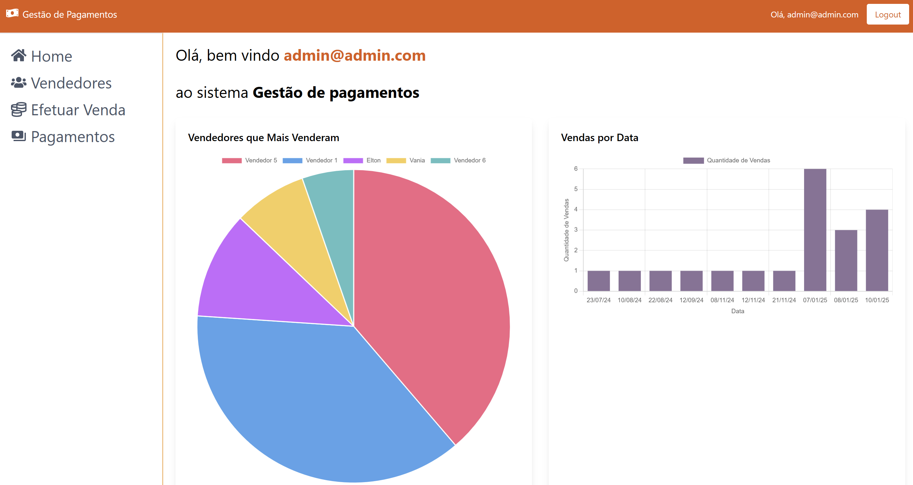
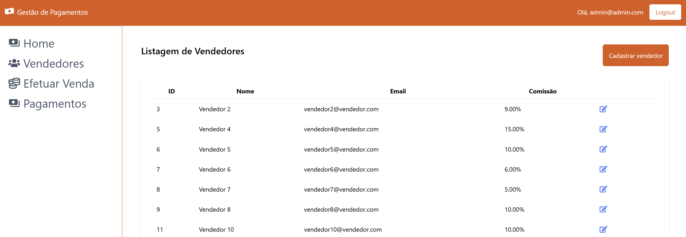
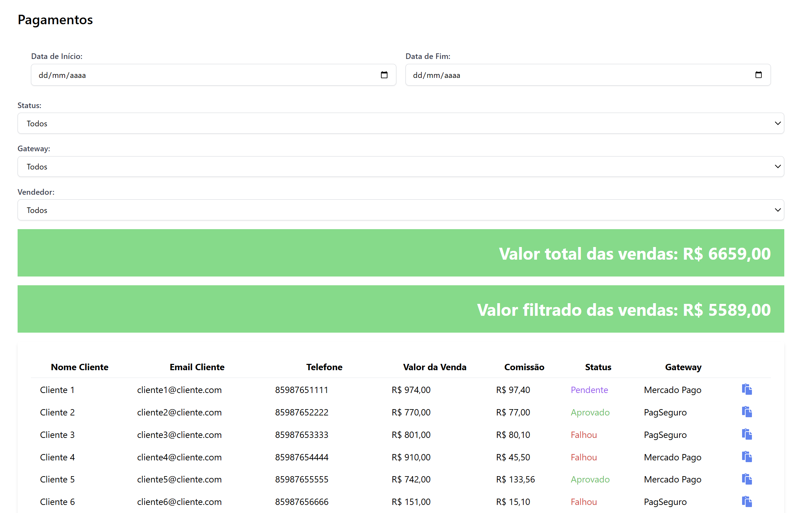

<p align="center">
  
</p>

<p align="center">
  <a href="#-technologies">Technologies</a>&nbsp;&nbsp;&nbsp;|&nbsp;&nbsp;&nbsp;
  <a href="#-getting-started">Getting started</a>&nbsp;&nbsp;&nbsp;|&nbsp;&nbsp;&nbsp;
  <a href="#-project">Project</a>&nbsp;&nbsp;&nbsp;|&nbsp;&nbsp;&nbsp;
  <a href="#-endpoints">Endpoints</a>&nbsp;&nbsp;&nbsp;|&nbsp;&nbsp;&nbsp;
  <a href="#-features">Features</a>&nbsp;&nbsp;&nbsp;|&nbsp;&nbsp;&nbsp;
  <a href="#-layout">Layout</a>&nbsp;&nbsp;&nbsp;|&nbsp;&nbsp;&nbsp;
  <a href="#-next-steps">Next steps</a>
</p>

<h1 align="center">
  <a href="#" target="_blank">
    GESTÃO DE PAGAMENTOS
  </a>
</h1>

---

## 🧪 Technologies

This project was developed using the following technologies:

- [React](https://pt-br.reactjs.org/)
- [Rails](https://rubyonrails.org/)
- [Vite](https://vite.dev/)
- [Postgres](https://www.postgresql.org/)
- [Tailwind](https://tailwindcss.com/)
- [React Toastify](https://fkhadra.github.io/react-toastify/introduction)
- [React Router DOM](https://reactrouter.com/)
- [React Paginate](https://github.com/AdeleD/react-paginate)
- [React Modal](https://github.com/reactjs/react-modal)
- [Chartsjs](https://www.chartjs.org/)
- [React Charts](https://react-chartjs-2.js.org/)
- [React Icons](https://react-icons.github.io/)
- [Devise](https://github.com/heartcombo/devise)
- [Kaminari](https://github.com/kaminari/kaminari)
- [Faker](https://github.com/faker-ruby/faker)
- [JSONAPI Serializer](https://github.com/jsonapi-serializer/jsonapi-serializer)
- [Rack CORS](https://github.com/cyu/rack-cors)
- [Date FNS](https://date-fns.org/)

## 🚀 Getting started

Clone the project and access the folder

```bash
$ git clone https://github.com/eltonsantos/gestao-pagamentos.git && cd gestao-pagamentos
```

Follow the steps below

### Backend

```bash
$ cd backend

# Install the dependencies
$ bundle install

# Create database
### Change database.yml to credentials your db
$ rails db:create

# Run migrations
$ rails db:migrate

# Run seed
$ rails db:seed

# Start the project
$ rails s
```
Run in localhost:3000

### Frontend

```bash
$ cd frontend

# Install the dependencies
$ npm install

# Start the project
$ npm run dev
```
Run in localhost:5173

## 💻 Project

A full-stack system for managing payments and balances for merchants who conduct online sales. The platform will have various features, including the ability to register vendors, associate commissions, perform payment transactions, and view financial and customer data.

The application will consist of:

<b>Front-End (React):</b> User interface to view payments, register vendors, perform transactions, and view balances and commissions.

<b>Back-End (Ruby on Rails):</b> API to manage payment data, users (merchants and vendors), payment gateways (Mercado Pago and PagSeguro), commissions, and transactions.

## 📚 Endpoints

### User Endpoints

- GET /users

Returns a list of all registered users (admins and vendors).
Permissions: Restricted access to administrators.

- GET /users/:id
  
Returns the details of a specific user, identified by id.
Permissions: Access allowed to the user themselves or administrators.

- POST /users

Creates a new user (registers a vendor or admin).
Permissions: Access allowed to anyone wishing to register.

- PUT /users/:id
  
Updates the information of a specific user.
Permissions: Access allowed to the user themselves or administrators.

- GET /users/current
  
Returns the details of the authenticated user (the logged-in user).
Permissions: Access allowed only to the authenticated user.

### Customer Endpoints

- GET /customers

Returns a list of all registered customers.
Permissions: Restricted access to administrators.

### Payment Endpoints

- GET /payments

Returns a list of all completed payments.
Permissions: Restricted access to administrators or users with permission to view payments.

- GET /payments/:id
  
Returns the details of a specific payment, identified by id.
Permissions: Access allowed to the user themselves or administrators.

- GET /payments/top_selling_sellers
  
Returns the details of the top selling sellers.
Permissions: Access allowed only admin.

- GET /payments/sales_by_date
  
Returns the details of the sales by date.
Permissions: Access allowed only admin.

- POST /payments

Creates a new payment (executes a transaction).
Permissions: Access allowed to vendors or administrators.

### User Authentication

- POST /login

Logs in a user.
Permissions: Access allowed to any registered user.

- POST /logout

Logs out a user.
Permissions: Access allowed only to authenticated users.

- POST /signup

Registers a new user.
Permissions: Access allowed to anyone wishing to register.

## 🛠️ Features

- Login and Logout (admin and vendor)
- Register vendor
- Edit vendor
- Checkout
- View payments
- Filter payments
- Copy payment link

## 🔖 Layout

<p align="center">
  
</p>

<p align="center">
  
</p>

<p align="center">
  
</p>

## 🐾 Next steps

###### Escreverei essa parte em português

- [ ] Cobrir o sistema de testes! 👁‍🗨
- [ ] Alterar visual em dark/light mode 🌗
- [ ] Layout responsivo 1️⃣
- [ ] E muito mais... ❤💪🏼

---

## 👨🏻‍💻 Author

<h3 align="center">
  
  <br/>
  <strong>Elton Santos</strong> 🚀
  <br/>
  <br/>

 <a href="https://www.linkedin.com/in/eltonmelosantos" alt="LinkedIn" target="blank">
    
  </a>

  <a href="mailto:elton.melo.santos@gmail.com?subject=Olá%20Elton" alt="Email" target="blank">
    
  </a>

<br/>

Made with ❤️ by Elton Santos 👋🏽 [Entre em contato!](https://www.linkedin.com/in/eltonmelosantos/)

</h3>